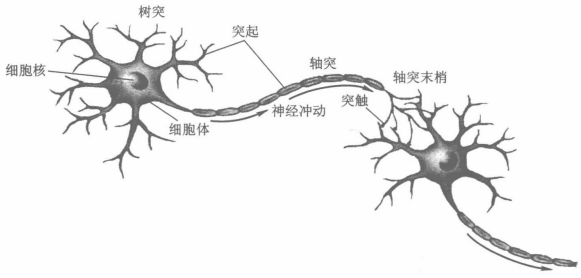
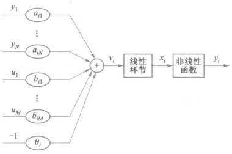

---
# 文章标题
title: ANN 神经网络基础
# 发布日期
date: 2024-04-09
# 文章描述（副标题）
description: 
# 文章底部显示的关于内容的标签
tags: 
    - 神经网络
# 是否启用对KaTeX的支持，默认为false
math: true
image: 1.png
    

# 顶部显示的分类标签
categories:
    - 神经网络
    - 人工智能
    - 机器学习
---

由于一些原因要学习神经网络，发现几乎所有资料的内容都比较含蓄，描述不清晰，结构不完整。几天学习下来很痛苦，决定结合自己的理解写个教程。（结果并非像我一开始想的那样对初学者友好，大概严格的公式理论仍然是绕不开的吧）

## 生物神经元结构

<!-- 注意！！！markdown文件名称必须为index.md，网页才能追踪到引用的图片，并自动缩放生成不同大小的版本。否则无法正常引用图片 -->

## 神经元数学模型

该模型由三部分组成，即**加权求和**、**线性动态系统**和**非线性函数映射**。

图中，$y_j$表示第$j$个神经元的输出，$\theta_i$表示神经元$i$的阈值，$u_k$（k=1,2,...,M）为外部输入，$a_{ij}$为神经元$j$到神经元$i$的权值。$b_{ik}$为外部输入$u_k$到神经元$i$的权值，计算时可以把外部输入看做某个神经元的输出（例如BP神经网络中的偏置节点）。

任意神经元$i$的输入可以看做两部分：从$y_1$到$y_N$代表的其他神经元的输出，以及从$u_1$到$u_M$代表的外部输入。
该图为了形式上的统一，把神经元的阈值$\theta_i$看作是以-1为外部输入时的权值，实际上很容易使初学者理解困难。
### 加权求和的数学描述：
用$v_i(t)$，$y_j(t)$，$u_k(t)$分别表示$t$时刻时，神经元$i$的状态（因为神经元的输出决定其状态，所以有时**神经元的输出又称为状态**，这两个词可能混用），神经元$j$的输出，第$k$个外部输入，则有：
$$
\begin{equation}v_i(t)=\sum_{j=1}^Na_{ij}y_j(t)+\sum_{k=1}^Mb_{ik}u_k(t)-\theta_i\end{equation}
$$

其中，$\begin{aligned}\sum_{j=1}^Na_{ij}y_j(t)\end{aligned}$表示$y_1$到$y_N$所有神经元的输出与权值乘积的和，代表其他神经元的输出对该神经元的直接影响。
$\begin{aligned}\sum_{k=1}^Mb_{ik}u_k(t)\end{aligned}$表示$u_1$到$u_M$所有外部输出与权值乘积的和，代表外部输入（如人工干涉）对该神经元的直接影响。
$\theta_i$为神经元$i$的阈值。
显然，所有输入大于阈值时，$v_i(t)>0$，神经元为兴奋状态，否则神经元为抑制状态。
### 神经元的输入输出关系
用$u_i$表示神经元的输入，$y_i$表示神经元的输出，则神经元$i$的输入输出关系表示为：

$$
\begin{equation}
y_i=f(u_i)
\end{equation}
$$
其中，$f$为激活函数。该式表明，所有神经元接收输入以后，把它作为参数传递给激活函数，得到该神经元的输出。
### 激活函数
根据函数的图像是否为直线，激活函数可分为**线性激活函数[^1]**和**非线性激活函数**。
激活函数的主要作用：
 1. 把输入映射到特定区间或特征值，既能决定神经元输出的值域，又可以把输入映射到特征空间（特征值）。
 2. 如果激活函数是非线性函数，可以极大地增强神经元的表达能力，建立从输入到输出的非线性映射。（一个非线性函数可以是任意个数的非线性函数与线性函数的叠加，因此具有极强的抽象表达能力）

在上图中，$v_i$只是加权求和的结果，还没有经过激活函数处理，不是最终的输出。
#### 常用的 非线性激活函数
对于任意神经元$i$，设$x_i$为输入，则输出为$f(x_i)$。
1. **阶跃函数**

$$
\begin{equation}f(x_i)=
\begin{cases}
0&{x_i<0}\\\
1&{x_i\ge0}\\
\end{cases}
\end{equation}
$$
$$
f(x_i)=\begin{cases}
-1&{x_i<0}\\\
1&{x_i\ge0}\\
\end{cases}
$$
不管神经元使用什么激活函数，对于神经网络最终的输出，都能够再使用一次阶跃函数实现从原始输出到特征值的映射。

2. **ReLU函数**
$$
f(x_i)=\begin{cases}
0&{x_i<0}\\\
x_i&{x_i\ge0}\\
\end{cases}
$$

ReLU函数形式简单，并且没有饱和问题，运算速度快，收敛效果好，常用于卷积神经网络。

3. **S型函数**

s型函数具有平滑、渐进和单调性，是最常用的非线性函数。

(1) **Sigmoid函数**
$$
\begin{equation}f(x_i)=\frac{1}{1+e^{-\alpha x_i}}\end{equation}
$$
该函数值域为(0,1)，即Sigmoid函数把神经元的输出映射到(0,1)区间。
缺点是，当输入的绝对值大于某个值以后，过快进入饱和状态（函数值趋于0或1，不再有显著的变化），出现梯度消失（梯度趋近于0）的情况，会导致模型训练时收敛缓慢，效果不佳。

(2) **双曲线正切函数**
$$
f(x_i)=\frac{1-e^{-\alpha x_i}}{1+e^{-\alpha x_i}}
$$
该函数值域为(-1,1)，即双曲线正切函数把神经元的输出映射到(-1,1)区间。
以上式子中的$\alpha$用于控制函数斜率，实际使用该函数时，通常省略该参数。
## 神经网络的分类
### 按结构分类
1. 前馈型

前馈型神经网络中，可分为不同的层，每一层神经元只与相邻的层相连。神经元的信号传递是单向的，
各神经元接收前一个（层）神经元的输入，并输出给下一个（层）神经元，没有任何反馈。
例如BP神经网络。

2. 反馈型

在反馈型神经网络中，存在一些神经元的输出，经过若干个神经元的传递后，又返回作为这些神经元输入的情况。
例如Hopfield神经网络。
### 按工作方式分类
如果神经网络中各神经元同时更新状态（输出），就是**同步**工作方式。
如果神经网络中各神经元按某种顺序，逐个更新状态（输出），每个神经元更新状态时，其他神经元状态不变，就是**异步**工作方式。
## Hebb学习规则
如果某一突触两端的神经元同时处于兴奋状态，它们的连接权值应该增强。
两个神经元的输出$y_i$和$y_j$越大，神经元越兴奋，权值就应该增强的越多。
用$w_{ij}$表示神经元$i$与$j$之间的权值，$k$表示时刻，则：
$$
w_{ij}(k+1)=w_{ij}(k)+\alpha y_i(k)y_j(k)\quad (\alpha > 0)
$$
即$\quad更新后的权值=当前权值+权值的改变量$。

[^1]:线性函数的通式为 $f=kx+b$

