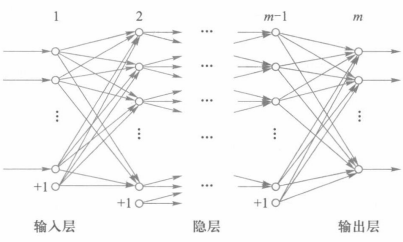
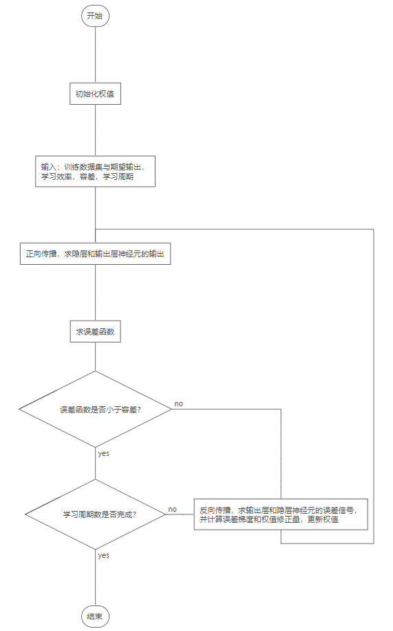

---
# 文章标题
title: BP神经网络与反向传播算法
# 发布日期
date: 2024-04-09
# 文章描述（副标题）
description: 
# 文章底部显示的关于内容的标签
tags: 
    - 神经网络
    - BP神经网络
# 是否启用对KaTeX的支持，默认为false
math: true
image: 1.png
    
# 顶部显示的分类标签
categories:
    - 神经网络
    - 人工智能
    - 机器学习
---

BP神经网络（Backpropagation Neural network），具有多层神经元，并且神经元的信号（输入输出）总是向前（由输入层指向输出层）传播，所以是多层向前网络。

## BP神经网络的结构



设BP神经网络有m层。第一层是输入层，最后一层（第m层）是输出层，中间各层称为隐层。

除了输出层以外，每一层都可以加上一个偏置节点（又称偏置单元，如图标注“+1”的圆圈）。偏置单元没有输入（没有其他神经元指向它），它的输出总是1。（相当于把外部输入“+1”看作是某个神经元的输出）。

因为偏置节点与神经元存在差异，所以**一般把神经元和偏置节点统称为节点**。

直觉上，偏置节点可以对下一层的神经元产生直接影响，而其他神经元因为经过了层层传递，对下一层的影响相对间接。

偏置单元并不是必需的，但它可以为每个隐藏层和输出层中的神经元提供一个可学习的常数偏移量，这个偏移量允许神经网络更好地拟合数据集并提高模型的表达能力。

并且偏置单元允许神经网络在输入为零时仍能有输出，在没有偏置单元的情况下，即使输入不为零，如果加权求和结果为零，那么神经元的输出也将为零（陷入得不到非零的有效输出，神经元无法激活的状况）。通过引入偏置项，即使输入为零，神经元也有可能激活，从而提高了网络的表达能力。
## BP神经网络的输入输出关系
BP神经网络中，输入层作为数据的缓冲，不对数据做任何处理。也就是说，**输入的数据直接作为输入层神经元的输出**，则：
$$
y_i^1=x_i\quad(i=1,2,\cdots,p_1)\\
$$

隐层和输出层的神经元，需要把神经元的输入作为参数，传递给激活函数，得到的结果作为神经元的输出。实际需要解决的问题都有着复杂的非线性特征，所以激活函数都选择**非线性函数**。

隐层$k$与输出层各个神经元的非线性输入输出关系记为$f_k(k=2,\cdots,m)$，由$k-1$层的第$j$个神经元到$k$层的第$i$个神经元的连接权值记为$w_{ij}^k$，第$k$层中第$i$个神经元的输入总和记为$u_i^k$,输出为$y_i^k$，则有：
$$
y^k_i=f_k(u_i^k)\\
u_i^k=\sum_jw_{ij}^{k}y_j^{k-1}\quad(k=2,\cdots,m)
$$
当从输入层输入数据$X=[x_1,x_2,\cdots,x_{p_1}]^T$（设第n层有$p_n$个神经元，则输入层有$p_1$个神经元），得到输出层的输出为$Y=[y_1,y_2,\cdots,y_{p_m}]^T$（输出层有$p_m$个神经元）。

计算机科学中，常用$[x_1,x_2,\cdots,x_{p_1}]$的形式表示一组序列，称为行向量（即水平方向的列表或者一维数组，向量是只有一个维度的矩阵）。而$T$代表线性代数中的矩阵转置操作，所以$[x_1,x_2,\cdots,x_{p_1}]^T$代表一个列向量，其中的元素从上往下排列，与BP神经网络结构图中，纵向画出的神经元一一对应。

例如输入层第$n$个节点的输入是$x_n$，输出层第$n$个节点的输出是$y_n$。

因此，可以把BP神经网络看成是一个从输入到输出的非线性映射，从$p_1$个输入映射成$p_m$个输出。

## BP定理
>给定任意$\varepsilon$>0，对于任意的连续函数$f$，存在一个三层前向神经网络，可以在任意$\varepsilon$平方误差精度内逼近$f$。

也就是说，只需要三层BP神经网络，就可以逼近任意一个连续的非线性函数，但是可能需要大量的隐层神经元个数，或者给BP神经网络添加更多的隐层数量。

如何最有效地确定BP神经网络的结构尚无定论，但通常默认，输入层的神经元个数，与样本的特征数一致，使每一个输入层神经元对应一种特征。输入层的神经元个数，与样本的类别数一致，使每一个输出层神经元对应一种分类。

## BP神经网络的运作过程



1. 初始化网络，确定各层的节点数量，然后**设置初始权值**。
2. 将数据归一化，然后从输入层输入**训练数据集（包含输入与期望输出）**，开始学习。
3. **前向（正向）传播**：从输入层开始，逐层计算神经元的输入与输出，直到得出输出层的输出为止。
4. **反向传播**（学习）：根据实际输出与期望输出，先计算输出层的总误差（**损失函数**）和输出层神经元的**误差信号**，然后逆向逐层计算所有神经元的**误差信号和权值修正量**，直到更新完所有神经元的误差信号和权值。
5. **重复前向传播和反向传播**，直到损失函数或者输出层神经元的误差信号足够小（与给出的容差进行对比），或者达到固定的学习次数（**每一次学习意味着先后进行一次前向传播和反向传播**），就停止学习。同时使用这两个判断条件，可以有效避免欠拟合与过拟合的情况。
6. 学习完成后，输入测试数据集，得到输出结果，将其映射为样本的具体类型。
## 权值初始化
在BP神经网络中，权值初始化是一个非常重要的步骤，它可以影响网络的收敛速度和性能。
常用的初始化方法如下：
1. 随机初始化
$$
w_{ij}^k=random(-a,a)
$$
所有权值表现为(-a,a)上的随机分布。

2. Xavier初始化
略
## 损失函数
损失函数，又称为代价函数，**误差函数**，在机器学习和统计建模中用于度量模型预测值与真实值之间的差异或损失程度，在BP神经网络中，表示输出层的实际输出与期望输出之间的总误差。
常用的损失函数$J$如下：
1. 均方误差
$$
J=\frac{1}{p_m}\sum_{j=1}^{p_m}(y_j^m-\hat{y_i})^2
$$
计算所有输出层神经元的输出与期望输出之间的差的平方和，最后求平均。
由于最后不求平均也能反映误差水平，所以为了求导计算结果的美观，这里选择将其乘以$\frac{1}{2}$，得到
$$
J=\frac{1}{2}\sum_{j=1}^{p_m}(y_j^m-\hat{y_i})^2
$$
下面将使用该式作为误差函数。
2. 平均绝对误差
$$
J=\frac{1}{p_m}\sum_{i=1}^n\lvert y_i^{p_m}-\hat{y_i}\rvert
$$
## 梯度下降法
BP算法的目标就是要通过反向学习，改变权值，使输出层的输出结果越来越接近期望输出。这个问题等价于，求误差函数的极小值，约束条件是上述的输入输出关系。

利用非线性规划中的“最快下降法（梯度下降法）”，使权值沿着误差函数的负梯度方向改变，得到神经网络权值的修正量为：
$$
\begin{equation}\Delta w_{ij}^{k-1}=-\varepsilon\frac{\partial J}{\partial w_{ij}^{k-1}}\quad(\varepsilon>0)\end{equation}
$$
其中，$\varepsilon$为学习步长（又称为学习效率），它决定了每次对权值修正量的大小。
学习效率太大可能导致误差函数增大，难以或者无法收敛到最优解。学习效率太小，则会导致收敛缓慢，需要更多的学习次数和更多的计算，增加学习成本，还可能导致陷入局部最优解无法跳出。
一般学习效率小于0.5。

梯度下降法中有一个重要概念，即**误差梯度**。在BP神经网络中，误差梯度表示**由误差函数对所有权值的偏导数构成的向量**，即

$$
\Delta E= \left[\frac{\partial J}{\partial w_{ij}^2},\frac{\partial J}{\partial w_{ij}^3},\frac{\partial J}{\partial w_{ij}^n},\frac{\partial J}{\partial w_{ij}^m}\right]\quad \left(\begin{aligned}&n=2,3,\cdots,m \\& i=1,2,\cdots,p_n \\ &j=1,2,\cdots,p_{n-1}\end{aligned}\right)
$$
其中，$p_n$表示第n层神经元的个数。

可以看到，$权值的修正量=-学习效率\times误差梯度元素$。
所以求所有权值的修正量，实际上就是求误差梯度。


对上式求偏导（由于本文章面向初学者，偏向应用，省略复杂计算），得
$$
\frac{\partial J}{\partial w_{ij}^{k-1}}=\frac{\partial J}{\partial u_{i}^{k}}y_j^{k-1}
$$

记
$$\begin{equation}d_i^k=\frac{\partial J}{\partial u_i^k}\end{equation}$$
则
$$
\Delta w_{ij}^{k-1}=-\varepsilon d_i^ky_j^{k-1}\quad(k=2,\cdots,m)
$$

对 (2) 式求偏导，得
$$
\begin{equation}d_i^k=\frac{\partial J}{\partial y_i^k}f_k^{'}(u_i^k)\end{equation}
$$
分两种情况求 (3) 式：
1. 对输出层（第m层），$k$=$m$，$y_i^k=y_i^m$，计算得
$$
d_i^m=(y_i^m-\hat{y_i})f_m^{'}(u_i^m)
$$
2. 对于隐层$k$，计算得
$$
d_i^k=f_k^{'}(u_i^k)\sum_ld_l^{k+1}w_{li}^{k+1}
$$
综上，BP学习算法可归纳为**一般式**
$$
\Delta w_{ij}^{k-1}=-\varepsilon d_i^ky_j^{k-1}\\\
d_i^m=(y_i^m-\hat{y_i})f_m^{'}(u_i^m)\\\
d_i^k=f_k^{'}(u_i^k)\sum_ld_l^{k+1}w_{li}^{k+1}\quad(k=m-1,\cdots,2)
$$
为了便于求导，取激活函数$f_k$为Sigmoid函数，即
$$
y_i^k=f_k(u_i^k)=\frac{1}{1+e^{-u_i^k}}
$$
把$y_i^k$与$f_k$代入一般式，则BP算法归纳为
$$
\Delta w_{ij}^{k-1}=-\varepsilon d_i^ky_j^{k-1}\\\
d_i^m=y_i^m(1-y_i^m)(y_i^m-\hat{y_i})\\\
d_i^k=y_i^k(1-y_i^k)\sum_ld_l^{k+1}w_{li}^{k+1}\quad(k=m-1,\cdots,2)
$$

可以看出，要求第$k$层节点的误差信号$d_i^k$，就要先求$(k+1)$层的误差信号$d_i^{k+1}$。求所有节点的误差信号，求所有权值，求误差梯度，三者是同时进行的。

误差信号的求取是一个从输出层到输入层的反向传播的递归过程，所以称为反向传播（Backpropagation，BP）学习算法。
## 输入输出的编码
在实际问题中，样本特征和分类都是抽象的描述，而神经网络的输入只能接收数值类型，并且输出也是数值类型。所以需要对它们进行编码。

当然不是所有的样本特征都需要编码。比如以数列作为样本进行分类（如等比和等差数列等），其本身就是数值类型，所以无需编码，这个例子还有一个特殊的地方在于，数列的每一个单独的数值，都不能作为数列的特征，因为这些数值只有作为一个整体，才能表达数列的特征。
### 样本特征的编码
很多实际问题中的样本特征，都是难以量化的，为此，需要把这些特征映射为**特征值**，才能作为输入。
特征值通常取{0,1}或者{-1,1}。

例如，水果的分类问题：
|    |1                          |0
|----------------|-------------------------------|-----------------------------|
|外形|        圆      |椭圆
|质地          |光滑          |粗糙     |
|质量|$\le$ 300g|$>$ 300g|

任意一个水果，若特征值描述为$X=[x_1,x_2,x_3]$，其中，$x_1$，$x_2$，$x_3$分别对应外形、质地、质量三种特征。
则一个圆形，粗糙，质量小于300g的水果，其特征值为[1,0,1]。
### 分类的编码
在分类问题中，需要为每一个分类设定一种编码（可称为**名义输出**），也就是指定**分类所对应的输出层神经元的输出**。

输入学习样本时，为了保证每一个样本数据对应一种分类，需要同时输入一个名义输出作为期望输出，和一个标签作为分类的名称。一般把所有样本数据的集合称为**数据集**，所有标签的集合称为**标签集**。数据集、期望输出列表和标签集，是一一对应的。

与特征值一样，名义输出值通常是整数，取{0,1}或者{-1,1}。

这样，神经网络在学习过程中，不断缩小实际输出与期望输出（名义输出）的差值，就是不断地强化神经网络对样本的分类准确度；当神经网络输出了某个设定的名义输出，就可以判定样本的分类。

由于一般输出层神经元数与分类数保持一致，所以可以让每一个神经元输出对应一种分类，只有一个输出可以取1，其他的只能取0，但输出1的神经元可以变化。例如在四分类问题中，四种名义输出分别为[1,0,0,0]，[0,1,0,0]，[0,0,1,0]，[0,0,0,1]。这样可以保证不同分类的输出，有两位是不同的[^2]。

如果输出层神经元数与分类数不一致，比如四分类问题中，输出层只有3个神经元，名义输出可以设置为[0,0,0]，[0,1,1]，[1,0,1]，[1,1,0]。这种选值方式也是为了保证不同分类的输出，有两位不同，所以没有使用[0,0,1]等其他值。

直觉上，制造更大的区分度，更有利于神经网络对分类的判别。但这样的分类编码也存在一些问题，比如输出值可能与任何名义输出都不相同，则无法确定分类，这种情况也一定程度上反映了神经网络的学习效果不佳。

实际上存在其他的分类方法，可以避免无法确定分类的情况，即使用softmax函数处理输出，把输出层的输出转换成概率分布，每一个神经元的输出，对应一种分类的概率，总能够选出概率最大的分类。
softmax函数如下：
$$
f_i^m=\frac{e^{y_i}}{\begin{aligned}\sum_{n=1}^{p_m}e^{y_n}\end{aligned}}\quad(i=1,2,\cdots,p_m)
$$
其中$p_m$为输出层神经元的个数，$f_i^m$表示输出层的第$i$个神经元输出转换成概率的结果。

[^2]:信息论中的海明距离，用于描述两个等长编码之间不同位的个数，这里可以说海明距离为2。

### 输出到分类的映射
由于BP神经网络使用非线性激活函数，最终输出通常是小数的序列，而名义输出为整数序列，所以需要把输出层的输出映射成整数，通常使用非线性函数中的**阶跃函数**完成这种转换
$$
f(x_i)=\begin{cases}
0&{x_i<0}\\\
1&{x_i\ge0}
\end{cases}
$$
$$
f(x_i)=\begin{cases}
-1&{x_i<0}\\\
1&{x_i\ge0}
\end{cases}
$$

针对不同的名义输出，选择恰当的阶跃函数，就解决了这个问题。

## 实例应用与代码

以下是一个使用BP神经网络，对数列进行分类的代码示例：

```python
import numpy


# 神经元类
class Neuron:
    def __init__(self, weights):
        # 神经元有一个权重列表，包含其到下一层神经元的权重
        self.weights = weights
        self.output = 0  # 到下一层节点的输出
        self.deviationSign = None  # 误差信号

    def __str__(self):
        return f"[误差信号：{self.deviationSign}, 输出：{self.output}, 权重：{self.weights}]"


# 神经网络类
class NerveNet:
    def __init__(self, struct, offset=1):
        """
        创建神经网络
        :param struct: 各层神经元数量的数组（不包括每层的偏置节点），每层的实际节点数为struct[i]+1，输出层没有偏置节点！
        :param offset: 偏置值
        """
        layers = []
        nodes = []
        self.targets = None  # 分类标签
        self.desireValues = None  # 期望值（分类对应的输出）

        # 遍历层
        for i in range(len(struct) - 2):
            # 遍历节点(每层加上一个偏置节点）
            for j in range(struct[i] + 1):
                # 除了输出层，都要设置权值
                if i != len(struct) - 1:
                    nodes.append(Neuron([numpy.random.uniform(-0.1, 0.1) for x in range(struct[i + 1] + 1)]))
                else:
                    nodes.append(Neuron(None))
            nodes[-1].output = offset  # 最后一个节点是偏置节点，输出永远为偏置值
            layers.append(nodes)

        # 倒数第二层没有对偏置节点的权值
        nodes = []
        for i in range(struct[-2] + 1):
            nodes.append(Neuron([numpy.random.uniform(-0.1, 0.1) for x in range(struct[-1])]))
        nodes[-1].output = offset  # 最后一个节点是偏置节点，输出永远为偏置值
        layers.append(nodes)

        nodes = []
        # 输出层没有权值和偏置节点
        for i in range(struct[-1]):
            nodes.append(Neuron(None))
        layers.append(nodes)

        self.layers = layers

    def __str__(self):
        str = "["
        for i in range(len(self.layers)):
            str += "["
            for j in range(len(self.layers)):
                str += __builtins__.str(self.layers[i][j])
            str += "], "
        str += "]"
        return str

    def study(self, inputs, desireValues, targets, step, cycle=None, tolerance=None):
        """
        开始学习
        :param inputs: 训练集
        :param desireValues: 期望输出
        :param targets: 分类标签，与训练集的元素对应
        :param step: 学习步长（效率）
        :param cycle: 学习周期数
        :param tolerance: 容差
        :return:

         学习的终止条件有两种：
            1.完成指定的学习周期数。

            2.输出层的误差小于给定的容差。
            完成指定的学习周期数：

优点：
简单直观：学习周期数是一个易于理解和控制的参数，因为它表示网络在整个数据集上迭代的次数。
可调性：可以根据经验或实验结果调整学习周期数，以平衡训练时间和模型性能。
缺点：
可能导致过拟合：如果学习周期数设置得太高，可能会导致模型在训练数据上过度拟合，而在测试数据上泛化性能不佳。
输出层的误差小于给定的容差：

优点：
直接衡量网络性能：输出层误差是对模型性能的直接度量，反映了网络在当前权重下的预测准确度。
精确控制：通过调整容差可以更精确地控制训练终止条件。
缺点：
受数据分布影响：输出层误差可能受到数据分布的影响，如果训练数据存在噪声或不均衡，可能会导致误差不稳定。
在实践中，通常会将这两个条件结合使用，以确保模型训练的有效性和稳健性。比如，在训练过程中同时监控学习周期数和输出层误差，当其中一个条件满足时停止训练。这样可以避免过度拟合，并在网络性能达到一定水平后及时停止训练，节省时间和计算资源。

        """
        self.desireValues = desireValues
        self.targets = targets

        if cycle is not None:
            for i in range(cycle):
                for j in range(len(inputs)):
                    self.forward(inputs[j])
                    self.backward(desireValues[j], step)
        elif tolerance is not None:
            # 使用容差时，先学习一遍，再进行判断
            for j in range(len(inputs)):
                self.forward(inputs[j])
                self.backward(desireValues[j], step)
            while self.getFinalDeviation(desireValues) > tolerance:
                for j in range(len(inputs)):
                    self.forward(inputs[j])
                    self.backward(desireValues[j], step)

    # 把原始输出映射到特征空间，然后根据特征值判断分类
    def getEigenValue(self):
        eigenvalue = []
        for node in self.layers[-1]:
            if node.output < 0.5:
                eigenvalue.append(0)
            else:
                eigenvalue.append(1)
        return eigenvalue

    def work(self, dataset, targets):
        """
        学习完成后的工作函数
        :param dataset: 待测数据集
        :param targets: 待测数据的真实标签
        :return:
        """
        eigenvalue = None
        count=0
        for index in range(len(dataset)):
            self.forward(dataset[index])
            eigenvalue = self.getEigenValue()
            print(f"\n输入为：{dataset[index]}，原始输出为："
                  f"{[self.layers[-1][x].output for x in range(len(self.layers[-1]))]}，特征值为：{eigenvalue}，")
            for i in range(len(self.desireValues)):
                if numpy.array_equal(self.desireValues[i], eigenvalue):
                    print(f"判断分类为 {self.targets[i]}，正确分类为 {targets[index]}", end="\n")
                    if self.targets[i]==targets[index]:
                        count+=1
                    break
        print(f"共{len(dataset)}个输入，有{count}个分类正确，正确率{count/len(dataset)*100:.2f}%")

    # def sigmoid(self, input, function):
    #     """
    #     激活函数
    #     :param input: 神经元的输入
    #     :param function:
    #     :return:
    #     """
    #     if function.lower()=="sigmoid":
    #
    #     elif function.lower()==""
    #
    #     return numpy.exp(-input)

    def calculateOutput(self, layerNum, count):
        """
        计算节点的输出
        :param layerNum: 节点层数
        :param count: 节点顺序
        :return:
        """
        input = 0
        node = self.layers[layerNum][count]
        # 节点的输入 = 上一层所有节点与权值乘积之和

        """
        注意！不同于一些其他语言，在python中循环使用的迭代变量具有函数作用域，而不是块作用域。
        这意味着该变量在函数外可见。
        如果在循环之前已经存在同名变量，循环会改变该变量的值！
        """
        for each in self.layers[layerNum - 1]:
            input += each.output * each.weights[count]

        # 把节点输入作为参数，传给激活函数，得到节点的输出
        node.output = 1 / (1 + numpy.power(numpy.e, -input))

        """
        输出语句
        python中的浮点类型与整型计算时，不能使用+=符号
        """
        # print(f"节点{layerNum+1}-{count+1}的输出: "+str(node.output))

    # 向前传播
    def forward(self, input):
        # 设置输入层的输出
        for i in range(len(self.layers[0]) - 1):
            self.layers[0][i].output = input[i]

        # 遍历层
        for i in range(1, len(self.layers)):
            # 遍历列（不包括偏置节点）
            for j in range(len(self.layers[i]) - 1):
                # 计算每个节点的输出
                self.calculateOutput(i, j)

        # 因为输出层的最后一个节点不是偏置节点，所以单独计算
        self.calculateOutput(len(self.layers) - 1, len(self.layers[-1]) - 1)

    def getFinalDeviation(self, desireValues):
        """
        计算输出层的总误差
        :param desireValues: 期望输出列表
        :return:
        """
        value = 0
        for i in range(len(self.layers[-1])):
            value += numpy.power(self.layers[-1][i].output - desireValues[i], 2)
        return value / 2

    def getDeviationSign(self, layerNum, count, desireValue):
        """
        计算各神经元的误差信号
        :param layerNum: 层数
        :param count: 顺序
        :param desireValue: 期望输出
        :return:
        """
        node = self.layers[layerNum][count]

        if layerNum == len(self.layers) - 1:
            node.deviationSign = node.output * (1 - node.output) * (node.output - desireValue[count])
        else:
            node.deviationSign = (node.output * (1 - node.output) *
                                  sum(self.layers[layerNum + 1][x].deviationSign * node.weights[x]
                                      for x in range(len(self.layers[layerNum + 1]))))
        """
        输出语句
        """
        # print(f"节点{layerNum+1}-{count+1}的误差信号：{node.deviationSign}")

    def updateWeights(self, step):
        """
        权值学习；
        前一层节点到后一层节点的权值修正量= -(步长)*后一层节点的误差信号*前一层节点的输出
        :param layerNum:
        :param count:
        :param step: 学习步长
        :return:
        """
        for i in range(len(self.layers) - 1):
            for j in range(len(self.layers[i])):
                # 遍历下一层的节点
                for k in range(len(self.layers[i + 1])):
                    # 计算误差梯度
                    correction = -step * self.layers[i + 1][k].deviationSign * self.layers[i][j].output
                    # 权值学习
                    self.layers[i][j].weights[k] += correction

                    """
                    输出语句
                    """
                    # print(f"节点{i+1}-{j+1}的误差梯度：{correction}")
                    # print(f"节点{i+1}-{j+1}的权值更新：{self.layers[i][j].weights[k]}")

        # for i in range(len(self.layers)):
        #     for j in range(len(self.layers[i])):
        #         print(self.layers[i][j].weights)

    def backward(self, desireValue, step):
        """
        反向传播
        :param desireValue: 期望输出
        :return:
        """
        # 逆向遍历 range生成从len()-1到-1的逆序序列（步长为-1）
        for i in range(len(self.layers) - 1, -1, -1):
            for j in range(len(self.layers[i])):
                self.getDeviationSign(i, j, desireValue)

        self.updateWeights(step)


struct = [4, 8, 3]  # 输入层特征数，隐层神经元数，输出层分类数

train = [
    [1, 2, 3, 4],
    [100, 101, 102, 103],
    [1, 3, 5, 7],
    [50, 52, 54, 56],
    [1, 4, 9, 16],
    [9, 16, 25, 36],
    [2, 4, 8, 16],
    [20, 40, 80, 160],
    #[10, 12, 14, 16],
]


desire = [
    [0, 0, 1],
    [0, 0, 1],
    [0, 1, 0],
    [0, 1, 0],
    [1, 0, 0],
    [1, 0, 0],
    [1, 1, 1],
    [1, 1, 1]
    # [0,1,0]
]

targets = [
    "公差为1的等差数列",
    "公差为1的等差数列",
    "公差为2的等差数列",
    "公差为2的等差数列",
    "x的平方数列",
    "x的平方数列",
    "公比为2的等比数列",
    "公比为2的等比数列",
    # "公差为2的等差数列"
]

test = [
    [2, 3, 4, 5],
    [4, 6, 8, 10],
    [9, 16, 25, 36],
    [120, 122, 124, 126],
    [3,6,12,24]
]

testTargets=[
    "公差为1的等差数列",
    "公差为2的等差数列",
    "x的平方数列",
    "公差为2的等差数列",
    "公比为2的等比数列"
]

nerveNet = NerveNet(struct)
nerveNet.study(train, desire, targets, 0.1, 2000)
nerveNet.work(test, testTargets)

```


